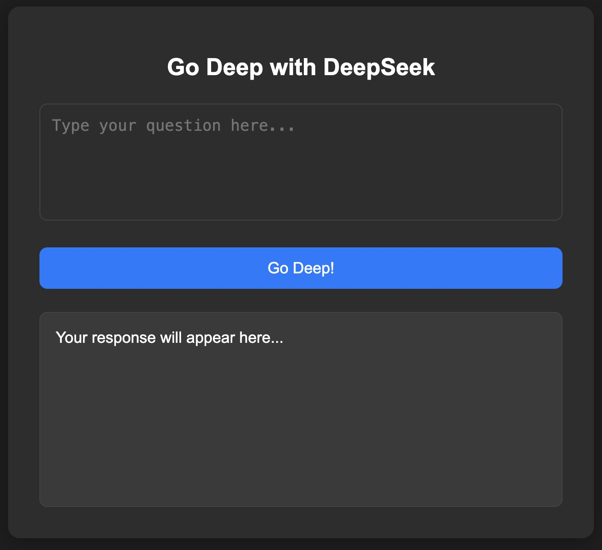

# deepseek-vs README

Welcome to the **deepseek-vs** extension! This extension integrates the power of the **DeepSeek** model into Visual Studio Code, allowing you to ask questions and get AI-powered responses directly in your editor.

---

## Features

- **Ask Questions**: Type your question in the input box and get responses from the DeepSeek model.
- **Streaming Responses**: Responses are streamed in real-time for a smooth user experience.
- **Dark Mode Support**: The interface is designed to match VS Code's dark theme.
- **Responsive Design**: Works seamlessly across different screen sizes.


*Example of the deepseek-vs extension in action.*

---

## Requirements

To use this extension, you need to install **Ollama** and run the **deepseek-r1:7b** model. Follow these steps:

1. **Install Ollama**:
   - Download and install Ollama from the official website: [https://ollama.ai/](https://ollama.ai/).
   - Follow the installation instructions for your operating system.

2. **Run the DeepSeek Model**:
   - Open a terminal and run the following command to start the `deepseek-r1:7b` model:
     ```bash
     ollama run deepseek-r1:7b
     ```
   - Ensure the model is running before using the extension.

---

## Extension Settings

This extension contributes the following settings:

- `deepseek-vs.enable`: Enable/disable the extension.
- `deepseek-vs.model`: Specify the model to use (default: `deepseek-r1:7b`).

To configure these settings, go to **File > Preferences > Settings** and search for `deepseek-vs`.

---

## Known Issues

- **Model Not Running**: If the Ollama model is not running, the extension will not be able to generate responses. Ensure the model is running before using the extension.
- **Slow Responses**: Response times may vary depending on your system's performance and internet connection.

---

## Release Notes

### 1.0.0
- Initial release of **deepseek-vs**.
- Integrated with Ollama and the `deepseek-r1:7b` model.
- Added a user-friendly interface for asking questions and viewing responses.

### 1.0.1
- Fixed issue with response streaming.
- Improved error handling for missing Ollama installation.

### 1.1.0
- Added support for custom model configurations.
- Improved UI responsiveness and dark mode compatibility.

---

## Following Extension Guidelines

This extension follows the official [VS Code Extension Guidelines](https://code.visualstudio.com/api/references/extension-guidelines). If you have suggestions or feedback, please open an issue on the [GitHub repository](https://github.com/your-repo/deepseek-vs).

---

## Working with Markdown

You can edit this `README.md` file directly in Visual Studio Code. Here are some useful shortcuts:

- Split the editor (`Cmd+\` on macOS or `Ctrl+\` on Windows and Linux).
- Toggle preview (`Shift+Cmd+V` on macOS or `Shift+Ctrl+V` on Windows and Linux).
- Use `Ctrl+Space` to see a list of Markdown snippets.

---

## For More Information

- [Visual Studio Code's Markdown Support](https://code.visualstudio.com/docs/languages/markdown)
- [Markdown Syntax Reference](https://help.github.com/articles/markdown-basics/)

---

**Enjoy using deepseek-vs!** 🚀
